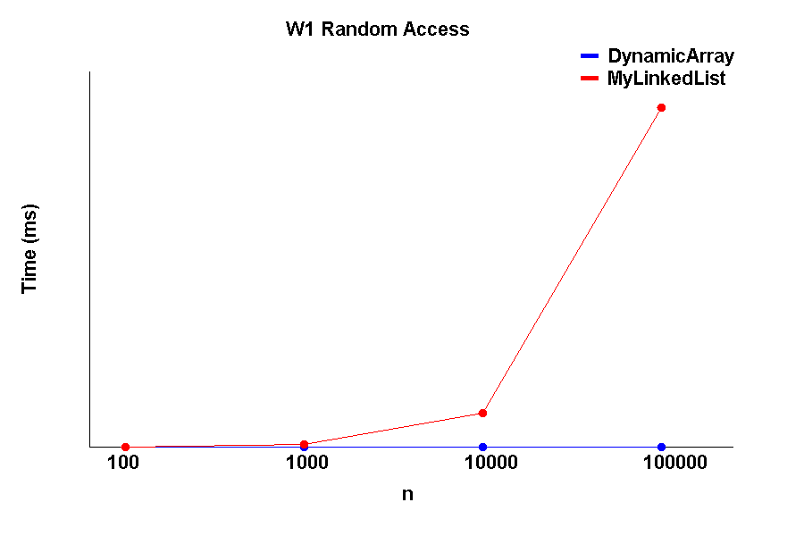
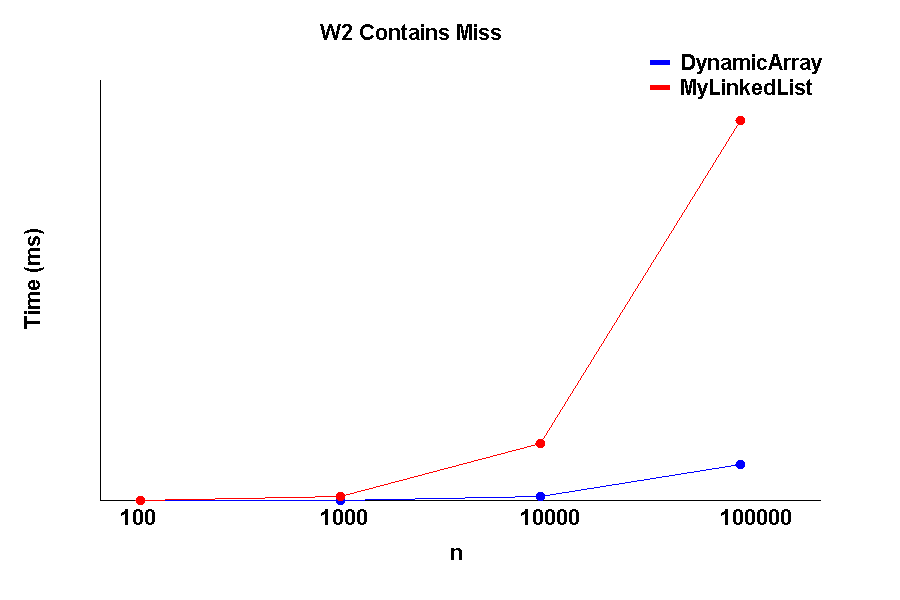
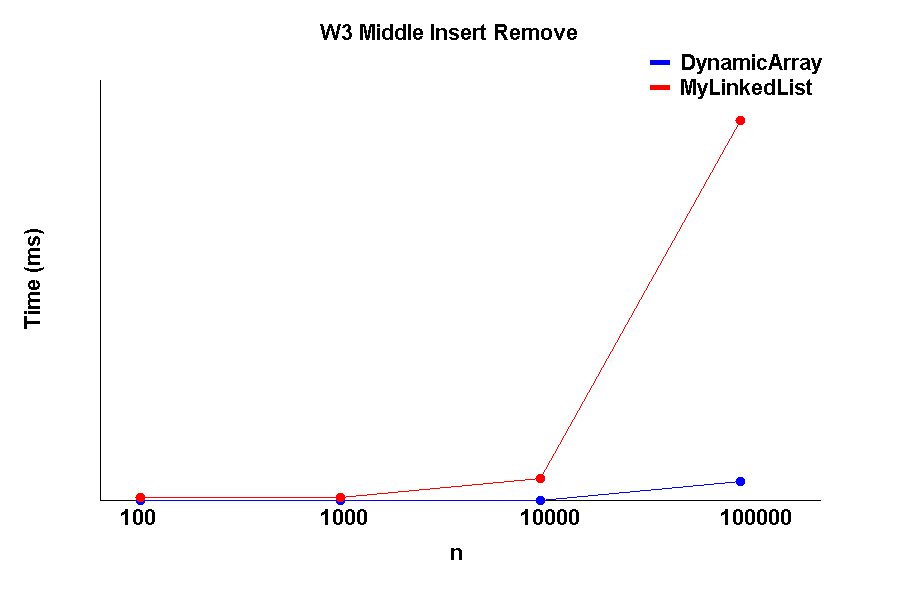
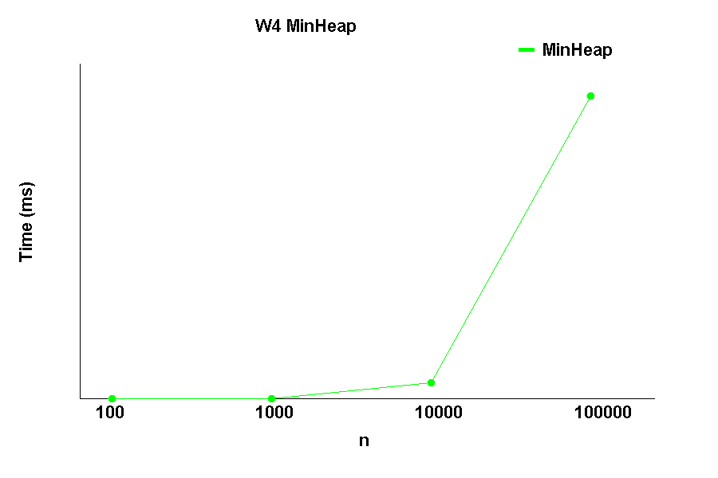

# DAA Assignment 2 – Data Structures & Empirical Analysis

## Student Information

**Student:** Zhalgas Miras  
**Project:** DAA Assignment 2  
**Language:** Java  
**Build Tool:** Maven

---

## 1. Introduction

This project implements and experimentally compares three data structures:

- Dynamic Array
- Singly Linked List
- Binary Min-Heap

The goal is to compare theoretical time complexity with empirical benchmark results.

The project also collects operation metrics such as steps, moves, and comparisons.

---

## 2. Implemented Data Structures

### 2.1 DynamicArray

`DynamicArray` is implemented using an integer array.

Implemented operations:

- `add(x)`
- `add(index, x)`
- `remove(index)`
- `get(index)`
- `contains(x)`
- `size()`

When the internal array becomes full, its capacity is increased.

### 2.2 MyLinkedList

`MyLinkedList` is implemented as a singly linked list.

Implemented operations:

- `add(x)`
- `add(index, x)`
- `remove(index)`
- `get(index)`
- `contains(x)`
- `size()`

Each node stores a value and a reference to the next node.

### 2.3 MinHeap

`MinHeap` is implemented using an array-based binary heap.

Implemented operations:

- `insert(x)`
- `extractMin()`
- `size()`

The minimum element is stored at the root of the heap.

---

## 3. Complexity Analysis

| Data Structure | Operation | Time Complexity |
|---|---|---|
| DynamicArray | get(index) | O(1) |
| DynamicArray | contains(x) | O(n) |
| DynamicArray | add(x) | O(1) amortized |
| DynamicArray | add(index, x) | O(n) |
| DynamicArray | remove(index) | O(n) |
| MyLinkedList | get(index) | O(n) |
| MyLinkedList | contains(x) | O(n) |
| MyLinkedList | add at head | O(1) |
| MyLinkedList | add in middle | O(n) |
| MyLinkedList | remove at head | O(1) |
| MyLinkedList | remove in middle | O(n) |
| MinHeap | insert(x) | O(log n) |
| MinHeap | extractMin() | O(log n) |

---

## 4. Benchmark Methodology

The benchmark was executed for the following input sizes:

- 100
- 1,000
- 10,000
- 100,000

Each benchmark case was executed 5 times.

The median execution time was used to reduce the effect of timing noise.

Before timing, warm-up operations were executed.

The benchmark results are stored in:

`results/results.csv`

The CSV file contains:

- workload
- variant
- structure
- n
- time_ms
- steps
- moves
- comparisons

---

## 5. Workloads

### W1 – Random Access

10,000 random `get(index)` operations were performed.

Expected result:

DynamicArray should be faster because indexed access is O(1), while MyLinkedList requires traversal and is O(n).

### W2 – Contains Miss

10,000 searches for values that do not exist in the data structure were performed.

Both DynamicArray and MyLinkedList have O(n) theoretical complexity for `contains`.

### W3 – Insert and Remove

The benchmark performs insertions and removals at two positions:

- head
- middle

For DynamicArray, middle operations require shifting elements.

For MyLinkedList, middle operations require traversal.

### W4 – Heap Operations

Random values were inserted into MinHeap and then repeatedly removed using `extractMin()`.

The extracted values were checked to ensure they were in nondecreasing order.

Both insertion and extraction have O(log n) theoretical complexity.

---

## 6. Metrics

The project uses a `Metrics` class to collect operation counts.

The following metrics are recorded:

- steps
- moves
- comparisons

These metrics help explain performance differences independently of execution time.

---

## 7. Benchmark Results

### W1 – Random Access

The DynamicArray performs random indexed access efficiently because `get(index)` is O(1).

The linked list must traverse nodes to reach an index, so its operation count increases significantly as n grows.

---

### W2 – Contains Miss

Both structures require a linear search when the requested value does not exist.

Therefore, the number of operations increases with the input size.

---

### W3 – Middle Insert and Remove

Middle insertion and removal are expensive for both structures.

DynamicArray must shift elements, while MyLinkedList must traverse nodes to reach the middle position.

---

### W4 – MinHeap

MinHeap maintains heap ordering during insertion and extraction.

The benchmark confirms that all extracted elements remain in nondecreasing order.

---

## 8. Testing

JUnit 5 was used for correctness testing.

Three test classes were created:

- `DynamicArrayTest`
- `MyLinkedListTest`
- `MinHeapTest`

A total of 12 tests were implemented.

The tests check:

- adding elements
- indexed insertion
- removing elements
- retrieving elements
- contains
- size
- duplicate values
- invalid indices
- heap ordering

All tests pass successfully.

---

## 9. Git Workflow

The project uses the following branches:

- `main`
- `feature/array`
- `feature/list`
- `feature/heap`
- `feature/metrics`

Each feature was developed separately and integrated into the main project.

---

## 10. Conclusion

The empirical results generally agree with the theoretical complexity analysis.

DynamicArray is well suited for random indexed access because `get(index)` is O(1).

MyLinkedList is less efficient for indexed access because it requires traversal.

Both structures require linear work for unsuccessful `contains` operations.

Middle insertion and removal demonstrate the different costs of array shifting and linked-list traversal.

MinHeap efficiently maintains the minimum element using logarithmic insertion and extraction operations.

Overall, the experiment demonstrates how the choice of data structure affects both theoretical complexity and practical performance.